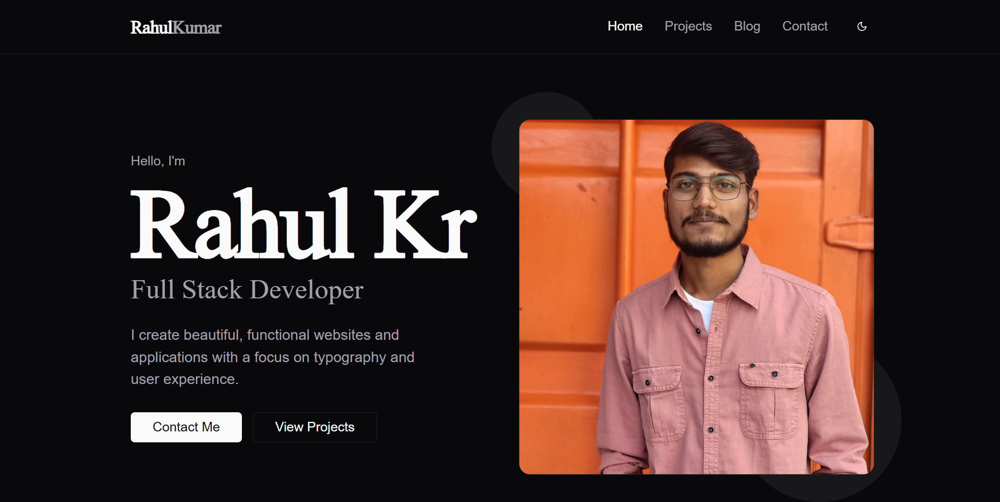

# Rahul Kumar – Portfolio Website

A modern, responsive developer portfolio built with **Next.js**, **React.js**, and **Tailwind CSS**.  
Showcases projects, blog articles, and contact information with a clean, accessible design.  
Features dynamic routing, SEO optimization, dark mode, and interactive UI elements for an engaging user experience.

---

## 🚀 Demo

- **Live Site:** [https://your-portfolio-domain.com](https://your-portfolio-domain.com)
- **GitHub Repo:** [https://github.com/thenamerahulkr/portfolio](https://github.com/thenamerahulkr/portfolio)

---

## 📋 Table of Contents

- [Features](#features)
- [Tech Stack](#tech-stack)
- [Screenshots](#screenshots)
- [Getting Started](#getting-started)
- [Project Structure](#project-structure)
- [Contributing](#contributing)
- [License](#license)
- [Contact](#contact)

---

## ✨ Features

- ⚡️ **Next.js App Router** for fast, modern routing
- 🎨 **Tailwind CSS** for utility-first, responsive design
- 🌗 **Dark/Light Mode** toggle
- 📝 **Blog system** with Markdown/HTML support
- 🗂 **Dynamic Projects Showcase**
- 🔗 **Social and Contact Links**
- 🖼 **Image optimization** with Next.js `<Image />`
- 📱 **Mobile-friendly** and accessible
- 🛠 **SEO** and meta tags for better discoverability

---

## 🛠 Tech Stack

- [Next.js](https://nextjs.org/)
- [React.js](https://react.dev/)
- [Tailwind CSS](https://tailwindcss.com/)
- [Lucide Icons](https://lucide.dev/)
- [TypeScript](https://www.typescriptlang.org/)
- [Vercel](https://vercel.com/) (deployment)

---

## 📸 Screenshots

> _Add your screenshots here for visual reference!_

---

## 🏁 Getting Started

1. **Clone the repo:**

2. **Install dependencies:**

3. **Run the development server:**

4. **Open [http://localhost:3000](http://localhost:3000) in your browser.**

---

## 📂 Project Structure

---

## 🤝 Contributing

Contributions, issues and feature requests are welcome!  
Feel free to [open an issue](https://github.com/thenamerahulkr/portfolio/issues) or submit a pull request.

---

## 📄 License

This project is [MIT](LICENSE) licensed.

---

## 📬 Contact

- **Email:** [thenamerahulkr@gmail.com](mailto:thenamerahulkr@gmail.com)
- **LinkedIn:** [linkedin.com/in/thenamerahulkr](https://www.linkedin.com/in/thenamerahulkr)
- **Twitter:** [twitter.com/thenamerahulkr](https://twitter.com/thenamerahulkr)
- **Portfolio:** [https://your-portfolio-domain.com](https://your-portfolio-domain.com)

---

> _Built with ❤️ by Rahul Kumar_
